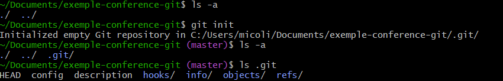

### Mini Intro

Toutes les infos dans le .git du projet server nécessaire que pour pull/fetch et push

(eurotherm): 

pour un projet de 1Go
.git 9.6Go => 262 branch

Au clone ⇒ .git 2.4Go pour 1 branch

Yann:

projet 23.1Go total

procelain command ⇒ commande user friendly

plumbing command ⇒ commande interne et qui n’ai pas censé être utilisée

## Stocker les changements

Chaque changement est transformé en Blob dans le fichier:  `.git/objects`

Commande git add ⇒ Crée le Blob

⇒ Hash le contenue (2 premier caractères en folder et le reste en nom du blob)

Dans le Blob il y a le hash de la modification

`git cat-file blob blob-name`permet de lire le blob, (modif dedans) (blob-name c’est le hash du content, donc folder + nom du fichier)

Un blob contient un snapshot d’un fichier à moment donné, une copie du contenur du fichier

Apply est donc facile

Revert ?

Pas de meta data à propos du fichier dans le blob, seulement les changements

### Why Split the Hash?

1. **Avoid Too Many Files in One Directory**:
    - Filesystems (especially older ones) can struggle with performance if a single directory contains **tens or hundreds of thousands of files**.
    - By splitting the hash, Git distributes objects across **256 subdirectories** (since there are 256 possible combinations of two hex digits: `00` to `ff`).
2. **Efficient Lookup**:
    - When Git needs to find an object, it can quickly go to the correct subdirectory using the first two characters of the hash.
    - This makes object retrieval faster and more organized.
3. **Scalability**:
    - As a project grows, the number of objects increases. This structure ensures Git remains fast and efficient even with **millions of objects**.

### 🧪 Bonus: Git Packs

Eventually, Git also compresses and stores objects in **packfiles** to further optimize storage and performance, but the loose object format (with the two-character directory split) is the default for newly created objects.

### Modification

Le add ne supprime pas les Blob 

l’ancien blob contient toujours les ancien changement et le nouveau contient les changements entier

## Stocker les folders (arborescence de fichiers)

Si les blob contiennent les fichiers, comment on a stock les folders ?

### les Tree pour les subfolders de la racine

- les tree stock les noms des fichiers et des dossiers
- les blob ou les hash des trees
- le type d’objet
- les permissions

tree (racine)
├── blob ([README.md](http://readme.md/))
├── blob ([main.py](http://main.py/))
└── tree (src)
          ├── blob ([utils.py](http://utils.py/))
          └── blob (config.yaml)

(globalement toutes les metadata)

Comme les Blob, le nom des tree est le hash du contenue

Les Tree sont généré au commit et non au add contrairement au Blob, (pour l’instant, on va créer l’arbre à la main avec une plumbing command 🙂 ) 

Dans mon Tree, j’ai un blob, avec son nom et le fichier qui y ai lié

le Tree est aussi dans le dossier `.git/objects` 

/!\ info et pack

/!\ git packfiles

In Git, the `.git/objects/info` and `.git/objects/pack` directories serve specific purposes related to how Git stores and manages objects efficiently:

---

### 📁 `.git/objects/info`

This folder contains **metadata** about the objects stored in the repository. Most notably:

- **`alternates` file**:
    
    If your repository uses **object sharing** (e.g., via git alternates), this file lists paths to other object directories that Git should look into when resolving objects.
    
    This is useful for saving space when multiple repositories share common history (like forks or clones).
    

- It may also be used internally by Git for optimization or caching purposes, though it's usually empty unless alternates are configured.

---

### 📁 `.git/objects/pack`

This is where Git stores **packfiles**, which are compressed collections of Git objects.

- As your repository grows, Git periodically **packs** loose objects into `.pack` files to save space and improve performance.
- Each packfile has:
    - A `.pack` file: contains the actual compressed objects.
    - A `.idx` file: an index to quickly locate objects inside the pack.

Packfiles are especially useful for:

- Reducing disk usage.
- Speeding up operations like cloning, fetching, and pushing.

---

### 🔍 Summary

| Folder | Purpose |
| --- | --- |
| `.git/objects/info` | Metadata about object storage, especially alternates. |
| `.git/objects/pack` | Stores compressed packfiles for efficient object management. |

????? a revoir

Les Trees pointent vers l’ensemble des blob et autres Tree pour décrirent l’arborescance de fichier. 

### Commit

Les commits décrivent entièrement l’état du projet en  plus de l’heure, l’auteur et le “committer” du commit et un ou des commits parents.

 La plus part des commits ont 1 seul parent, les seuls exceptions sont le premier commit et les commits de merge (qui en ont 2 en général).

Initial Commit:

Autre Commit

### Branch

Toutes les branch référé dans .git/refs/heads/ , pointant vers un commit (le commit HEAD, le commit le plus récent)

Les tags sont dans .git/refs/tag/, pointant aussi vers un commit.

### Merge / Rebase

Pour merge 2 branches, git recherche le commit commun le plus récent en remontant dans l’historique des branches en remontant dans le commit parent pour chaque commit.

Une fois trouver, git creer un commit de merge dans la branch cible combinant les changements des 2 branches. Simple ? en vrai ça va !

Les commits de merge ont 2 commit parents

Merge avec —no-commit; —ff; —no-ff ?

| Aspect | `merge` | `rebase` |
| --- | --- | --- |
| Création d’un commit supplémentaire | ✅ Oui (commit de merge) | ❌ Non |
| Historique | Ramifié (graph avec branches) | Linéaire (comme une seule ligne) |
| Réécriture d’historique | ❌ Non | ✅ Oui (nouveaux commits) |
| SHA des commits | Inchangés | Recalculés |
| Sécurité (dans une branche publique) | ✅ Sûr | ⚠️ Dangereux (risque de conflits d’historique) |

Sources:

 https://how-to.dev/how-git-stores-data

https://www.atlassian.com/git/tutorials/using-branches/git-merge

https://www.simplilearn.com/git-rebase-vs-merge-article

https://git-scm.com/book/fr/v2